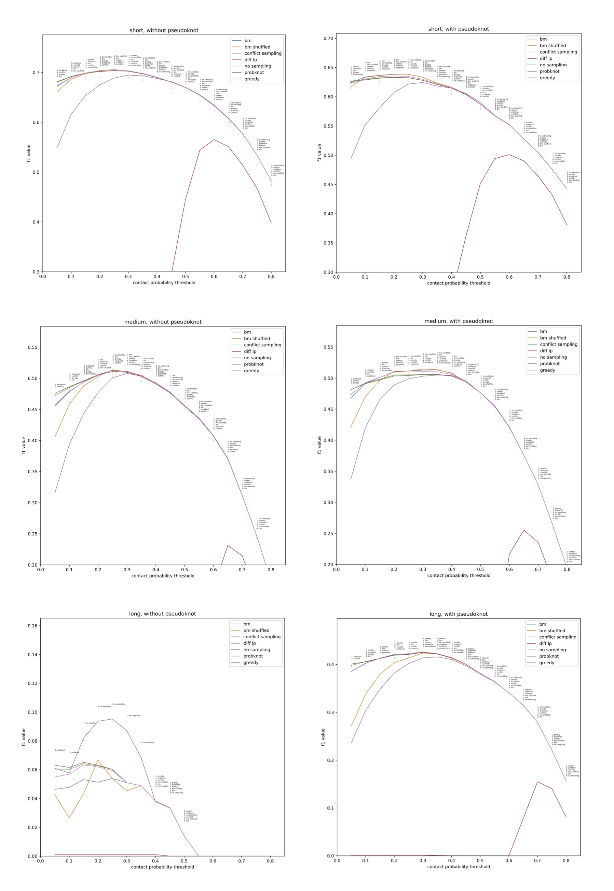
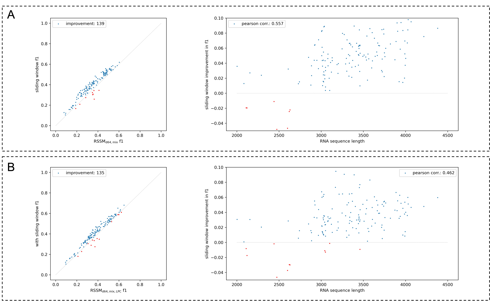
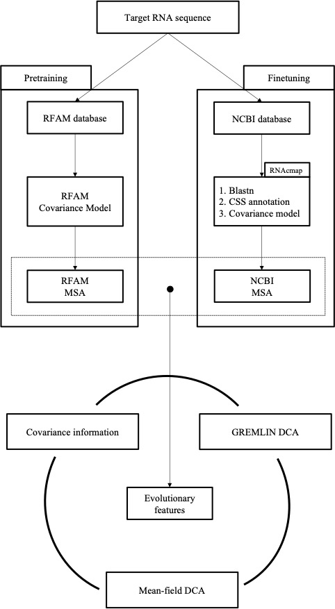

# RNA Secondary Structure Model (RSSM)

This repository hosts a novel RNA secondary structure prediction tool described in the paper: **Integrated pretraining with evolutionary information to improve RNA secondary structure prediction**.

RSSM is a hybrid convolutional and self-attention based solution that predicts RNA secondary structure either in single sequence based or multiple sequence alignment based fashions.


Our RSSM models are pretrained with Rfam sequences and/or Rfam deposited MSAs, in a supervised manner by leveraging readily available computational structures as proxy for true RNA secondary structures, i.e. LinearPartition contact map probabilities. Our models are further finetuned in bprna dataset.

We release three types of RSSM models:
- Single sequence based RSSM, equivalent to the $\mathrm{RSSM}_{\mathrm{d64,mix}}$ ensemble model from the paper 
- Covariance feature based RSSM, equivalent to the $\mathrm{RSSM}_{\mathrm{d64,T,rnafold}}$ ensemble model from the paper 
- Alignment based RSSM, equivalent to $\mathrm{MSA-RSSM}_{\mathrm{d64,T,rnafold}}$ in the paper 
<br></br>
## installation and dependency

RSSM is dependent on the following python packages that can be installed on Anaconda
- PyTorch (v1.8.0~v1.10.0; GPU compiled)
- numpy
- scipy
- pandas
- numba
- h5py (at least v3.1.0)
- yaml
- tqdm

We strongly recommend interested users installing these aforementioned python packages in a [miniconda3](https://docs.conda.io/en/latest/miniconda.html) environment:

```
conda create -n rssm_env python=3.6.8 -y
conda activate rssm_env
# check nvidia-smi to see if you need lower CUDA version
conda install pytorch==1.10.0 torchvision==0.11.0 torchaudio==0.10.0 cudatoolkit=11.3 -c pytorch -c conda-forge -y
conda install scipy pandas numba h5py=3.1.0 pyyaml tqdm einops requests -y
```

followed by local installation of the RSSM package in the created miniconda environment:

```
git clone https://github.com/HarveyYan/RSSMFold
cd RSSMFold
pip install -e .
```

<br></br>
## dataset

Link to the pretraining data:
- for single sequence based RSSM (3.4GB):
```https://drive.google.com/drive/folders/1zu6t2XXnybHSc8MXoUSUusaXOwM3D6Ol?usp=sharing```

- alignment based model RSSM (11.2GB):
```https://drive.google.com/drive/folders/188qbd8lv9MH4TvbBkJbzPNPjWUlS9DmF?usp=sharing```


Other datasets for model finetuning and testing can be found in the ```dataset``` folder:
- bprna training, validation and test sets
- the pdb TS1 test set
- nmr TS2 test set
- Rfam derived test set

<br></br>
## single sequence based RSSM

Example usage:
```
RSSMFold --input_fasta_path=examples/input.fasta --out_dir=./output --use_gpu_device 0 1
```

An RSSM model will be loaded onto GPU devices with id 0 and 1. Pretrained weights will be automatically downloaded from a shared dropbox link, upon first ```RSSMFold``` launch. RSSM will then proceed to predict RNA secondary structures for each sequence in ```examples/input.fasta```. Results will be saved to ```./output``` in ```bpseq``` format. In the following text, we will describe some useful command line options. For further information, please refer to  ```RSSMFold -h```.

- ```--generate_dot_bracket=True``` generates pseudoknot-free RNA secondary structures in dot-bracket format, on top of RSSM predicted structures in ```bpseq``` files. The elimination of pseudoknots is done by the ```FreeKnot``` program, which is included in the RSSM distribution.
- ```--save_contact_map_prob=True``` saves copies of predicted RNA contact map probabilities in ```npy``` format.
- ```--matrix_sampling_mode``` selects an RNA contact map discretization method. The figure below compares a selection of popular sampling techniques. For more details, please refer to our paper.


<p align="center">
  
</p>

- ```--use_lp_pred=True``` augments/ensembles RSSM predicted RNA contact maps with LinearPartition probabilities, which are beneficial for predicting long range basepairs.

```--use_lp_pred=True``` further requires the ```LinearPartition``` software. Please follow the instruction in this [link](https://github.com/LinearFold/LinearPartition) and install ```LinearPartition``` binary at RSSM root directory ```LinearPartition/linearpartition```.

```
git clone https://github.com/LinearFold/LinearPartition
cd LinearPartition
make
cd ..
```

- ```--enable_sliding_window=True``` only predicts RNA basepairs that reside in overlapping sliding windows, which is similar to ```RNAplfold```, an earlier thermodynamic model. The sliding window method trades the ability of predicting potential long range basepairs with higher accuracy in local RNA structures. This option enables fitting much longer sequences into GPUs as well. Its benefits are clearly identified and measured in the long RNA sequence regime, using sequences between 2000-4000 nts in the bprna-1m dataset, as shown in the figure below. For more information please refer to our paper.



<br></br>

## Alignment based RSSM

For obtaining evolutionary information, the following bioinformatics softwares are required:
- blastn
- viennarna
- infernal

Installation:
```
conda install -c bioconda blast=2.12.0 viennarna infernal=1.1.4 -y
```

This repository includes copies of RNAcmap and RFAM (v14.5), with all the needed parts in their original distributions. The only remaining requirement is to download the NCBI nucleotide database (~400GB).

#### To users on compute canada, you can find a public copy of NCBI database at: 
```
/cvmfs/ref.mugqic/genomes/blast_db/LATEST/nt
``` 

Since generating evolutionary features often require a substantial amount of time and compute, our alignment based RSSMs proceed in the following two steps:
- The first step is to generate evolutionary features using the ```CompEvoLib``` command and store them as a library that can be used or reused in whatever ways you desire. 
- The second step is to feed the generated library of evolutionary information to our alignment based RSSM models.

### Generating evolutionary features 

Example usage:
<p>
<code>CompEvoLib --input_fasta_path=examples/input.fasta --out_dir=./output --verbose=True --out_filename=test --method=rnacmap_rnafold --specify_blastn_database_path=../myowndatabase/nt_database/nt --enable_mp=True</code>
</p>

Important command line flags for this function include:
- ```--out_filename``` is the name of evolutionary feature library, in a directory specified by ```--out_dir```. The library will be in ```hdf5``` format.
- ```--method``` selects one from the following three options ```{rfamdb, rnacmap_rnafoldm rnacmap_rssm}```. ```rfamdb``` method will try to align the input RNA sequence to an existing RNA family; the other two options are described by the RNAcmap pipeline, with the ```consensus secondary structure``` either annotated by ```RNAfold``` or our own single sequence based ```RSSM```. The following picture should give you a rough idea of those two types of multiple sequence alignments. Please refer to our paper for more details.

<p align="center">
  
</p>

- ```--specify_blastn_database_path``` tells ```CompEvoLib``` where to find the NCBI nucleotide database index. Ignoring this option will make ```CompEvoLib``` searching for the nucleotide database at the default ```RNAcmap/nt_database/nt``` location.


#### Note

1. If ```rfamdb``` method is chosen, user would need to download additional Rfam covariance models and RNA sequences belonging to each RNA family. We provide a copy of Rfam database (v14.5) used in our own project: 
```wget -O - "https://www.dropbox.com/s/6ku9aqtobo66cq8/rfamv14.5_cm_and_fasta.tar.gz?dl=0" | tar zxf - -C RFAMV14.5/```

2. If ```rnacmap_rssm``` is chosen, user would need to specify additional command line options for the single sequence based RSSM, which are almost identical to what we have described earlier on in the previous section. Please refer to ```CompEvoLib -h``` for more information. 

3. ```CompEvoLib``` can incur heavy computational cost to your system. We recommend reserving 20 CPU cores for numba, blastn and Infernal parallel processing, which is the default number specified by the ```--ncores``` option. Use ```--enable_mp=True ``` to run 4 RNA sequences at the same time, and in this case, a minimal CPU RAM of 50 GB is recommended.


Finally, when ```CompEvoLib``` is finished (which can take quite a long time), evolutionary features, in the form of raw multiple sequence alignments and extracted covariance features,  will be safely stored in the ```--out_dir``` by the name ```--out_filename``` in ```hdf5``` formats. 


### Covariance feature based RSSM

Example usage:
<p>
<code>CovRSSMFold --input_evo_lib_path=output/test_evofeatures_rnacmap_rnafold.hdf5 --use_gpu_device 3 --save_contact_map_prob=True --constrained_pairing=True --use_lp_pred=True --out_dir='./output'  </code>
</p>

```CovRSSMFold``` shares near identical command line options as the single sequence based ```RSSMFold``` method.  

- ```--input_evo_lib_path``` in this option please specify the path to the evolutionary feature library generated in the previous step.

### MSA-RSSM

Example usage:

<p>
<code>MSARSSMFold --input_evo_lib_path=output/test_evofeatures_rnacmap_rnafold.hdf5 --out_dir=./msa_output --use_gpu_device 3 --generate_dot_bracket=True --save_contact_map_prob=True --enable_sliding_window=False --constrained_pairing=True  </code>
</p>

Note that ```MSARSSMFold``` processes one RNA (and MSA) at a time so there is no more ```batch_size``` argument. 

- ```--msa_depth_modulation_constant``` determines the maximal depth of every subsampled MSA from the original MSA 
- ```--max_nb_iters``` determines the maximal rounds of MSA subsampling, given the original MSA is larger than what ```--msa_depth_modulation_constant``` specifies

<br></br>

## Citing RSSMFold
If you have found ```RSSMFold``` useful in your research, please cite:

```
@article{yan2022integrated,
  title={Integrated pretraining with evolutionary information to improve RNA secondary structure prediction},
  author={Yan, Zichao and Hamilton, William Leif and Blanchette, Mathieu Daniel},
  journal={bioRxiv},
  year={2022},
  publisher={Cold Spring Harbor Laboratory}
}
```